# COPPERBENCH
### A PCB workbench that feels like a PCB.

**Version 1.7.1 · Green Shoe Garage / Field Instruments · 18 September 2026**

[CaseBench export](docs/CASEBENCH-EXPORT.md) · [Editing and export review](docs/EDITING.md) · [Pan the view](#new-in-v163--pan-the-view) · [Compact polarity](#new-in-v162--compact-polarity-markings) · [Quieter workbench](#new-in-v161--quieter-workbench) · [Modules & circuit blocks](#new-in-v16--modules-and-editable-circuits) · [Controller carriers](#controller-carriers) · [Everyday maker parts](#everyday-maker-parts) · [Polarity & silkscreen fix](#polarity-and-silkscreen) · [Power & ground planes](#power-and-ground-planes) · [Create vias](#create-vias) · [HATs & shields](#hats-shields-and-carriers) · [Get started](#start-here) · [Publish to GitHub](docs/GITHUB.md) · [Deploy](docs/DEPLOYMENT.md) · [Verification](docs/TESTING.md) · [Contribute](CONTRIBUTING.md)

Put down a board. Place recognizable parts. Connect their leads. Shape the copper. Add your markings. Inspect the files you will send for fabrication.

COPPERBENCH is a local-first, two-copper-layer PCB layout app with an editable, depth-rendered 3D workbench. **COPPERBENCH is the working title for this release.** The physical bodies are representative; pad geometry and the electrical connection model—not rendered pixels—drive routing, checking and manufacturing export.

## New in v1.7.1 — CaseBench board JSON

Click the **▾ beside Export board → CaseBench JSON**, or use **Board →
CaseBench JSON**. Review the dimensions and component/hole counts, then choose
**Download CaseBench JSON**. In CaseBench, import it as a CopperBench board.
No upload or service is involved.

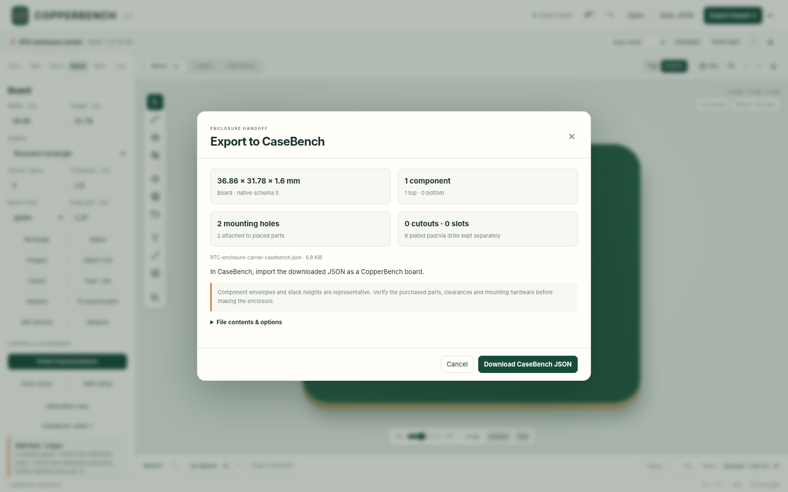

The download uses native **`app: "COPPERBENCH"`, schema 5, `units: "mm"`**.
Board shape/thickness, both-side components, local pads, active mounting holes,
slots, cutouts, vias, module/carrier metadata and placed block records are retained.
It does not flatten, move, mirror or rescale the geometry; the CaseBench importer
owns the conversion into enclosure coordinates. Representative module body height
already includes its modeled stack and is not increased again.

The default board snapshot omits artwork, image assets, saved baseline and unused
circuit-block templates. **File contents & options → Include project extras**
retains those too. Keep **Save JSON** for complete editable-project backups.
Unrouted nets or stale copper fills do not block this enclosure handoff. Pending
placement/edit proposals and changes after review do block downloading an obsolete
snapshot. File size and known CaseBench native-adapter bounds are preflighted.

No project-format migration or new runtime dependency. The target CaseBench app
was not available locally for an end-to-end import test; the native contract and
geometry preservation are tested, not physical enclosure fit. See the
[handoff guide](docs/CASEBENCH-EXPORT.md) and [verification record](docs/TESTING.md).

## New in v1.7 — editing and export review

Select the object you intend to edit with **Parts / Copper / Markings / Board
features** filters. Click a crowded location and press **]** to cycle overlapping
objects. Slide trace segments, move/insert/remove corners, replace a section and
clean redundant bends. Widths can target one segment, a trace, touching copper or
an explicitly selected whole net.

Turn on **Drag connected** for a rule-checked component/via move. Supported
centered endpoint attachments follow on their existing layers. A blocked or
unsupported move leaves the original board intact. This is deliberately limited:
no push-and-shove, locked attachments, through-middle junctions or pour-net moves.
Both manual trace changes and connected moves use **Keep edit / Cancel** previews
and one-step undo; they are not live, silent changes to the underlying copper.

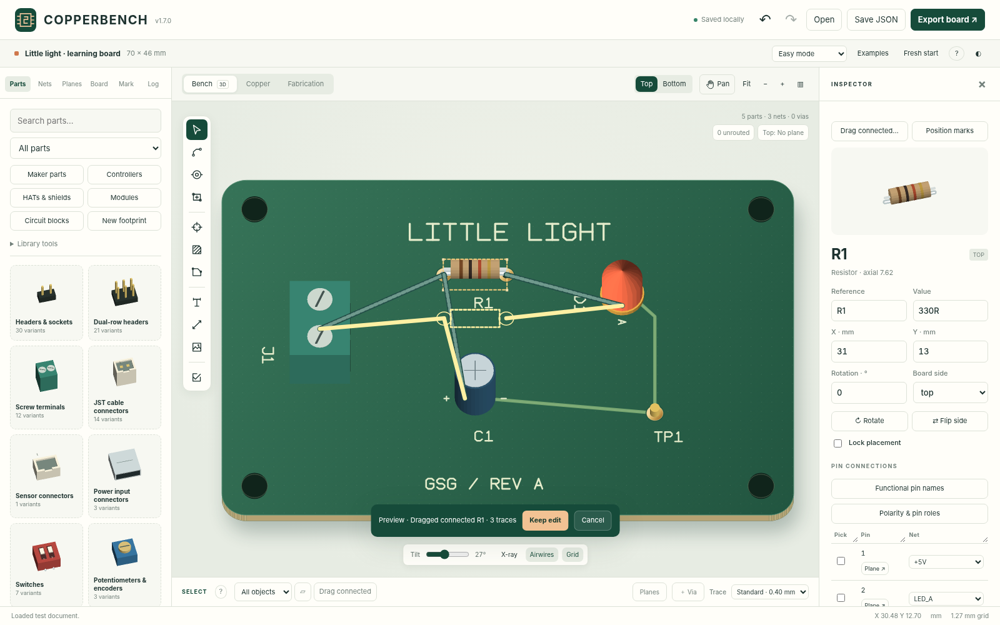

**Position marks** moves printed reference or polarity groups without moving pads.
Export review checks actual generated files against the reviewed revision, compares
drills, and reports sampled silk clipping. The ZIP now includes a revision manifest.
Unreadable local saves or detected other-tab changes pause autosave until explicitly
resolved; **Log → Recovery snapshots** can download both copies first.

All **193 parts, six circuit blocks and schema-5 projects** are retained. No new
runtime dependencies. Save a JSON backup before updating; replace the complete
static folder or portable HTML. See the [editing guide](docs/EDITING.md),
[verification record](docs/TESTING.md) and [qualification boundaries](docs/QUALIFICATION.md).
Native browser navigation and the optional third-party parser gate were **blocked**
in the release environment, not counted as passed. No manufacturer acceptance or
physical fabrication is claimed.

## New in v1.6.3 — pan the view

**Pan** now has a labelled button beside **Fit**, in all three views and on both
board faces. Toggle it with **P**, then drag anywhere on the canvas without moving
parts. **Space-drag** or **middle-drag** pans temporarily, including mid-trace.

Scroll pans while Pan is on; Ctrl/Command-scroll still zooms. On a touchscreen,
one finger in Pan or two fingers in any tool moves the view, with pinch zoom
anchored beneath the gesture. **Fit / Home** brings the board back to centre.

Selection, pending placements, unfinished traces, undo history and manufacturing
geometry are preserved. There is no new idle instruction banner, no dependency,
and no project-format change (schema 5). The 193 parts, six circuit starters,
planes, vias and compact printed polarity markings are retained.

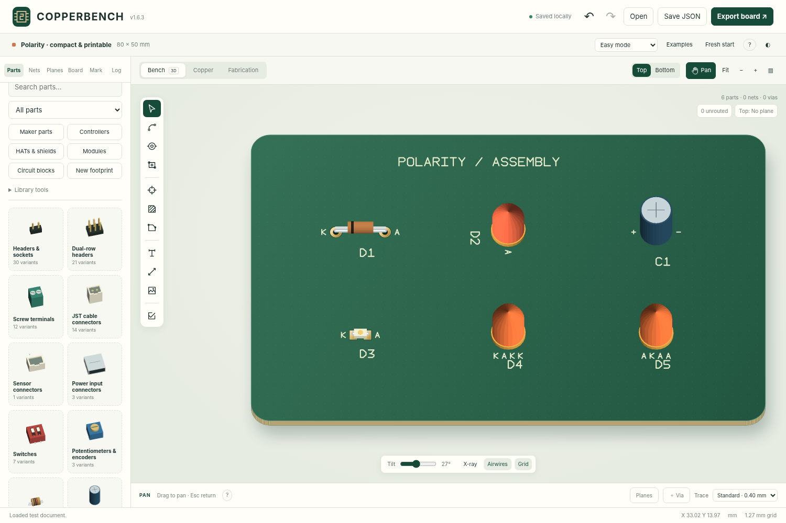

[Navigation controls and details](docs/NAVIGATION.md) · [Verification](docs/TESTING.md)

## New in v1.6.2 — compact polarity markings

Removed the always-on A/K billboards and the expanded name badges. The idle
workbench shows the actual small printable symbols. Selection, hovering a lead,
or routing exposes **9-pixel pin tags** placed outside projected component bodies,
including their height when the board is tilted. Full terminal names remain in
the tooltip, inspector and pin table; the small tags still select their actual pins.

**A/K and +/− are real silkscreen**, enabled by default, with 0.9 mm default print
height and 0.16 mm stroke. A direct **Print polarity on silkscreen** checkbox is
available in the selected-part inspector. **Polarity & pin roles → Compact print
defaults → Apply polarity labels** restores the small enabled print settings.
Screen tags and printed sizes are independent. Four-lead RGB LEDs now receive
separate, pin-ordered markings instead of overprinted A/K pairs.

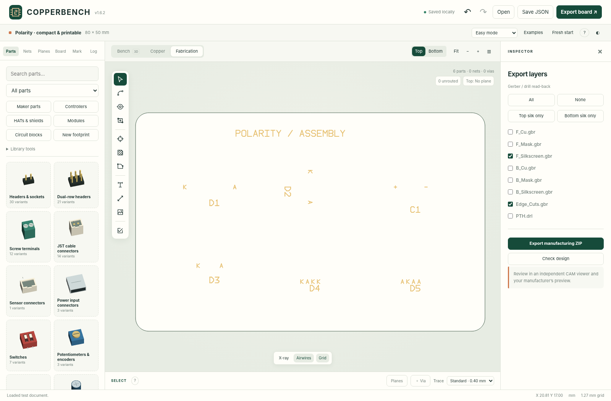

Existing explicit print settings and opt-outs are preserved. Back up your JSON,
inspect **Fabrication → Top silk only / Bottom silk only**, and regenerate the
manufacturing ZIP. Schema remains **5**. No pad, pin number, net, copper, or drill
geometry was changed by the label redesign. Read the [polarity guide](docs/POLARITY_AND_SILKSCREEN.md)
and [verification record](docs/TESTING.md). The [example board](examples/compact-polarity.json)
is an unconnected illustration, not a complete circuit.

## New in v1.6.1 — quieter workbench

The board is the focus. Removed the welcome overlay, canvas slogans, repeated
instructions and duplicate empty-inspector statistics. Search is first in the
parts drawer; a category selector replaces the filter-chip wall, and compact
catalog buttons replace long promotional labels. Additional block and footprint
actions live under **Library tools**.

The idle Select tool has no instructional sentence. Active tools display a short
next-step hint; the **?** beside the tool name opens complete instructions without
cancelling the operation. Header **?** or **H** opens the full guide and shortcuts.
Autosave, polarity, error/warning counts, clearance failures, confirmation dialogs
and fabrication-export gates remain visible and operational. Native schema 5,
the 193 parts and all six circuit blocks are unchanged.

**Upgrade:** save a JSON backup and replace the complete hosted app folder, or
replace the standalone HTML. No new schema migration is needed for v1.6 projects.
See the [interface guide](docs/QUIET_WORKBENCH.md) and [verification record](docs/TESTING.md).


## New in v1.6 — modules and editable circuits

**Five specific module interfaces and six reusable circuit starters.** The component
library now has **193 entries**; circuit blocks are a separate collection of editable
parts, copper and net intent—not six opaque additional footprints.

| Mount a purchased module | Build and edit a circuit |
|---|---|
| Adafruit BME280 original non-QT, DS3231 original eight-pin RTC, 0.96-inch OLED STEMMA QT, TB6612 breakout, and MPM3610 3.3 V module. | LED indicator, button with pull-up, I²C pull-ups, supply decoupling, DC-input topology, and RC signal filter. |
| Named pins, source CAD/blob references, optional mounting holes, adjustable assumed underside gap, and distinct representative 3D bodies. | Pre-routed internal copper, editable values, explicit external ports, fresh nets per insertion, one-step undo, group transforms and fresh-net copies. |

Open **Parts → Modules** or **Parts → Circuit blocks**. Module templates
place the mating headers on your carrier; the illustrated host electronics do not
leak into fabrication files. Block placement checks for new copper conflicts while
preserving intentionally unrouted connections as design findings.

Select a block member to **select the whole block, move/rotate/flip it with its
copper, copy it with fresh nets, export it, or detach the grouping**. Save selected
components/traces/vias to a project-local personal library; import and export
`.copperblock.json` files for sharing. GND is not silently shared between copies.

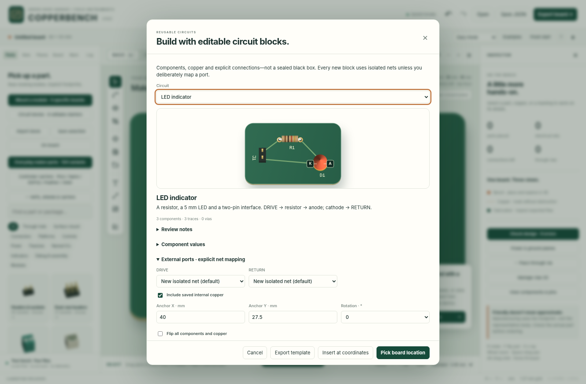

**Back up first. Native JSON now writes schema 5**, reading schemas 1–4 without
replacing existing embedded footprints. Older app versions reject the new format.
Source-referenced module interfaces and circuit examples are **not physically fit
tested, simulated or electrically certified**. KiCad retains ordinary supported
geometry/nets, not module metadata, block grouping or your personal library.

[Module and block guide, source ledger and limits](docs/MODULES_AND_BLOCKS.md) ·
[Verification](docs/TESTING.md) · [Compatibility](docs/COMPATIBILITY.md)

## Controller carriers

**v1.5 added 18 header-mounted interfaces for nine host selections; all are retained.** Start with **Parts → Controllers** or use
**Examples → Controller carriers**. Choose Pico, Pico 2, Pico W, Pico 2 W, classic
Nano A000005, ESP32-DevKitC V4 with WROOM-32E, the classic Feather interface,
original XIAO RP2040 or XIAO ESP32C3. Each has a carrier and an add-on variant;
Feather's add-on is a FeatherWing-style mating pattern.

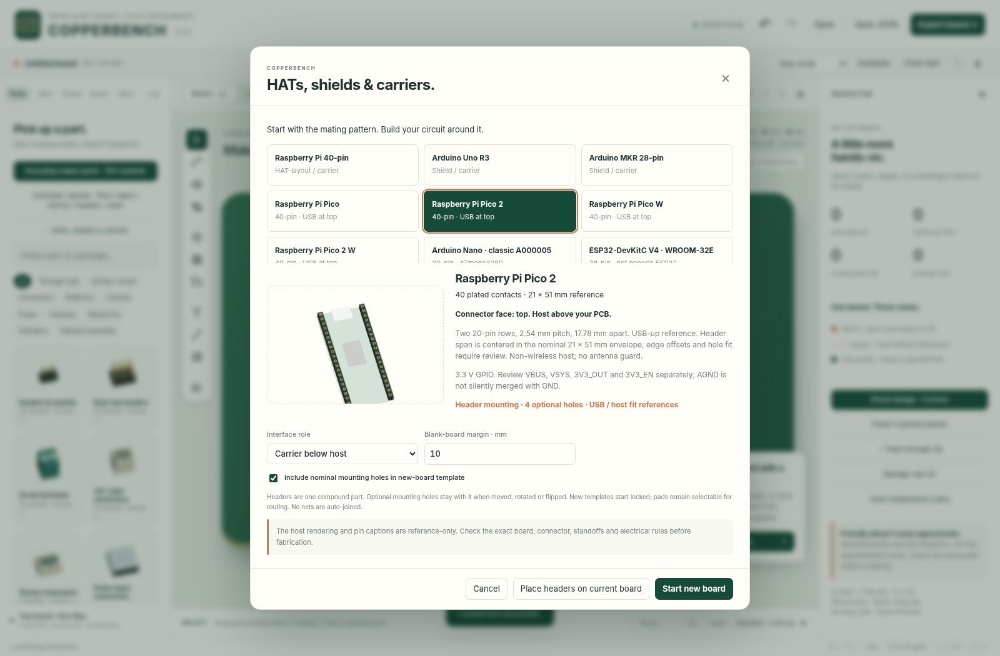

**Carrier clearances & fit** edits the assumed stack gap, USB/access projections,
and attached two-face antenna guards where applicable. Copper guards affect
manual routing, vias, automatic routing and plane fills. They follow moves,
rotations and flips; hiding their overlay never disables them. A guard override
requires a saved reason and remains a warning. XIAO ESP32C3 uses an external
antenna reference; generic Feather cannot imply a radio-specific keepout.

The footprint contacts are routable, named and included in manufacturing exports.
Host drawings and clearance overlays are editor-only. Optional mounting holes
are real NPTH geometry; ESP32 and XIAO do not receive invented holes. Existing
parts, optional Uno ICSP, vias, planes, polarity labels and repaired silk exports
are retained.

**These are nominal source-referenced templates, not fit-tested assemblies.**
The RF defaults are suggested projections, not complete manufacturer-qualified
clearances. Header-to-edge offsets, holes, connector drill size, stack gap and
cable access require actual-board review. The generic Feather entry provides
common aliases, not universal MCU pin mappings. Direct castellated mounting is
not included. See the [carrier guide and source/geometry qualifications](docs/CARRIERS.md).

**Native JSON now writes schema 5; older editors will reject it.** Schemas 1–4
open without silently replacing embedded footprints. Back up before upgrading.
KiCad exports active RF guards as independent keepouts, not linked constraints;
retain JSON as the lossless master. [18 starter projects](examples/carriers/) are
included. These starters are interfaces, not complete functioning circuits.

## Everyday maker parts

**v1.4 adds 134 variants in 17 families, for 170 total library entries at that release.** Choose
**Parts → Maker parts**, select a family and exact variant, and place it
on the board. The drawer groups variants instead of listing hundreds of similar
cards; search finds device names, manufacturers and pin functions directly.

Connectors include header/socket/right-angle variants, screw terminals, JST
PH/XH/SH, a Qwiic/STEMMA QT preset, and a selected GCT USB4085 USB-C connector.
Controls include switches, potentiometers and an encoder. Power/assembly entries
include regulators, protection templates, transistors, a relay, fuses, LEDs,
jumpers and test loops. Named NE555, LM358, SN74HC595, MCP23017 and ULN2803C package
entries expose actual pin functions instead of anonymous pad numbers.

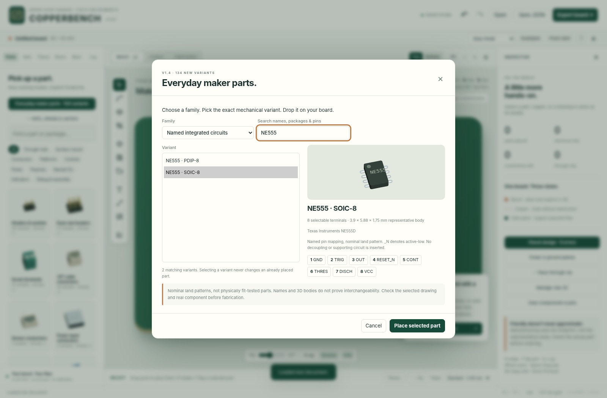

**Functional pin names** edits labels without changing pin numbers or nets.
Selected parts show editor-only captions; existing A/K and +/− polarity symbols
remain real printed silkscreen. **Part reference, notes & pin-map CSV** exposes
source links, cautions and review status. Internally common terminals assigned to
different nets produce a blocking finding—not an automatic merge.

**Arduino Uno R3 now has an optional ICSP 2×3 header.** Enable it in the platform
chooser or on an existing Uno part. Its six contacts are appended without changing
the original 32 pins or connections. Existing default templates stay unchanged.

**Important:** 134 variants does not mean 134 physically qualified purchased
components. Some entries are named-device references; others are explicitly
nominal parametric templates. Review the exact part, geometry, connector direction,
pin mapping and drill/slot capability before fabrication. USB connectors and
regulators are parts, not complete supporting circuits. No physical fit or
manufacturer approval is claimed.

Try **Examples → Everyday maker sampler**, or open
[`everyday-maker-sampler.json`](examples/everyday-maker-sampler.json). The example
is a layout sampler, not an electrically complete circuit. See the
[Maker Parts guide](docs/MAKER_PARTS.md) and [catalog index](docs/MAKER_CATALOG.md).
v1.6 uses schema 5 and retains these embedded footprints and checks. Back up before upgrading.

## Polarity and silkscreen

**v1.3.1 fixes an export defect that could clear the entire silkscreen. Open your
native project in this version and regenerate its manufacturing ZIP before
ordering. Previously downloaded Gerbers are not repaired by updating the app.**

Diodes and LEDs now identify **A · Anode** and **K · Cathode**. Polarized radial
capacitors identify **+ · Positive** and **− · Negative**. Small tags appear while
selecting or wiring, stay outside projected component bodies, and never expand
into full-name badges. Full names remain in tooltips, the inspector and pin table.

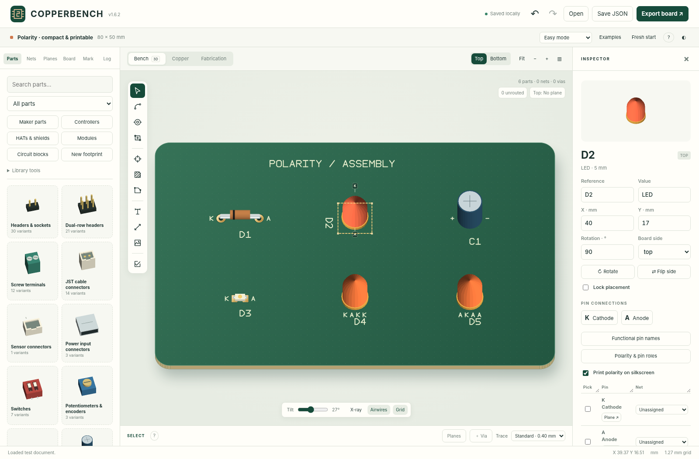

Select a component and open **Polarity & pin roles** to assign roles to custom or
imported pins, toggle printing, or adjust symbol size, clearance and offsets.
Printed A/K or +/− symbols follow the component's rotation and board face and are
included in the Gerbers. Hiding the reference label does not hide polarity marks;
disabling printed polarity does not remove the contextual pin tags. No operation
silently swaps pin numbers or reassigns nets. Unknown/numeric pin roles are not
guessed from net names or body appearance.

**Fabrication → Top silk only / Bottom silk only** shows the generated files
without component bodies or editor badges. Source text, part references,
polarity marks, drawing tools and converted images survive export, while pad
openings, holes, cutouts and off-board artwork are still cleared.

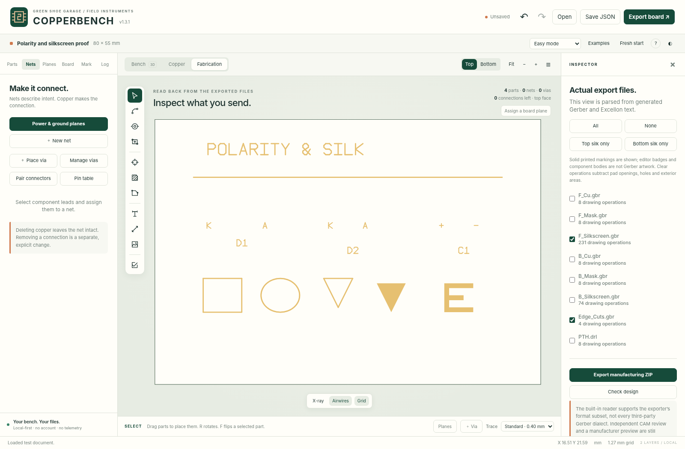

The old writer incorrectly treated nested Gerber contours like an even-odd hole.
The old viewer and Python test reader repeated that error. All three are fixed;
new tests explicitly reproduce the blank old output and require union semantics.
The clipping replacement uses individual exterior trapezoids, not another nested
frame. See the [fix guide](docs/POLARITY_AND_SILKSCREEN.md) and
[verification record](docs/TESTING.md). **No external CAM acceptance or physical
fabrication is claimed.** v1.6 writes schema 5; save a JSON backup first.

## Start here

**The simplest edition is `COPPERBENCH-portable.html`.** Open that file in a desktop browser. It includes the complete app, component definitions, ZIP support and routing/checking worker source. There is no build step, account, CDN or required internet service.

Alternatively, keep the static app folder together and open `index.html`. A local server is useful where browser file-origin policies interfere with local storage or workers:

```sh
cd copperbench
python3 tools/serve.py
```

Open `http://127.0.0.1:8000/`. Python is optional for using the portable HTML. Node and Python test dependencies are only needed for development/testing.

**Save JSON is your independent backup.** Autosave uses browser-local storage, which can be disabled, full, cleared, or unavailable for local files. A saved-state LED reports persistence status; a failed save does not disable JSON export. Downloaded JSON contains placed footprints and embedded source images.

The release uses a real Chromium DOM/canvas/worker harness with a storage test double and intercepted download blobs. Unrestricted `file://` launch, origin-backed storage, actual download navigation, and hosted service-worker installation were **not** directly verified. Read the [verification record](docs/TESTING.md) for exact coverage instead of treating “offline-capable” as a claim that every browser environment has been tested.

## Power and ground planes

Open **Planes → Bottom ground · top routing**. Or assign a net independently to
**Top copper** and **Bottom copper**. No whole-board polygon drawing is needed.
The plane follows the outline and automatically refills after copper edits.

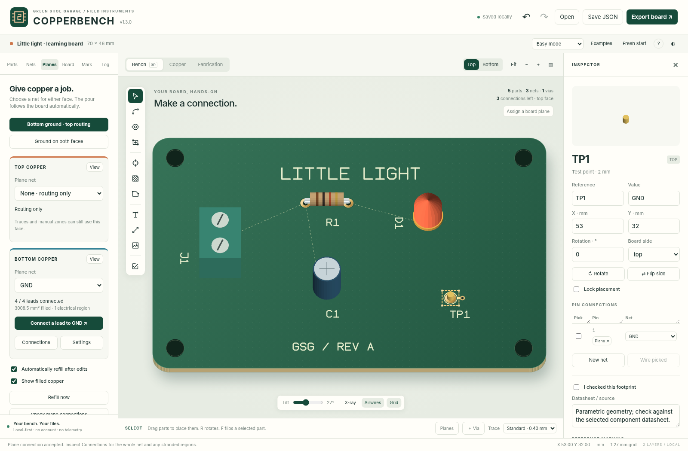

Choose **Connect a lead to GND** (or your selected net), click a component lead,
then review **Keep connection / Discard**. Through-hole and same-face pads use
existing direct contact when possible. Opposite-face surface-mount pads receive
a short trace and nearby through via, or reuse a suitable existing via. Inspector
pin buttons and picked multi-lead groups expose the same workflow.

**No silent net merges.** Unassigned leads adopt the target net only on acceptance;
a lead on a different net is blocked. Connection status uses real filled-copper
paths, not names. Split planes, stranded leads and stale fills remain visible.
Changing plane assignment does not relabel pins or existing copper. Manual zones
are preserved. New traces carve clearance through managed pours and may split them.

Thermal pad connections, solid via connections, per-face settings, a view-only
hide-fill control, manual refill and one-step undo are included. The local helper
is non-exhaustive and the existing fill engine is conservative/cell-derived.
**Native saves use schema 5 in v1.6; back up older projects before upgrading.**

[Plane workflow and limitations](docs/PLANES.md) · [Verification](docs/TESTING.md)

## Create vias

Click **＋ Via** beside the trace-width control, choose **Place via** in the Nets
panel, or press **Shift+V**. The inspector shows the via's net, copper-pad diameter,
drill diameter and solder-mask setting. Click the board to place; keep clicking
to place more. **Esc** leaves the tool.

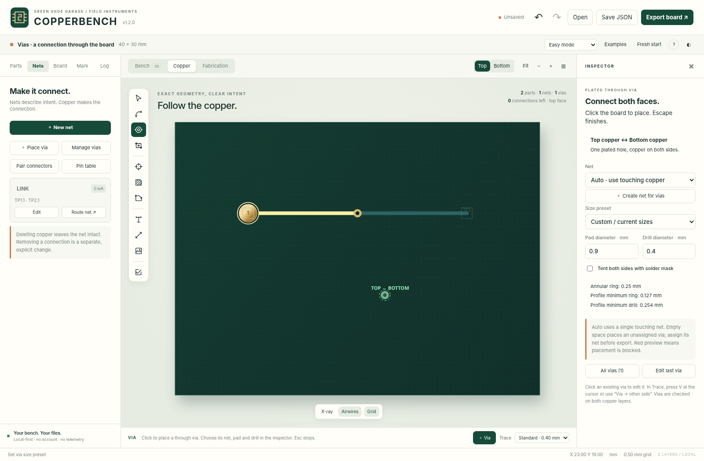

**Auto / from touching copper** takes the net from the copper beneath the via,
including the opposite face. A placement joining different nets is blocked.
For an empty area, choose a named net or create one. Unassigned vias remain
editable but produce a blocking finding before ordinary manufacturing export.
The green/red preview checks the selected rule profile on both copper layers.

| Preset | Copper pad diameter | Drill diameter |
|---|---:|---:|
| Compact | 0.70 mm | 0.30 mm |
| Standard | 0.90 mm | 0.40 mm |
| Large | 1.20 mm | 0.60 mm |

Enter custom dimensions as needed. Presets are geometric conveniences, not
current ratings or universal fabrication approval. The inspector displays the
annular ring and rejects dimensions below the active profile limits.

**During manual tracing**, press **V** at the cursor, or click **Via → other side**
and then the board. The incoming trace and via are one undoable edit, and the
route continues on the opposite layer. A rejected placement leaves the trace
and board unchanged. Traces can start or finish on existing vias and copper.

**To edit**, leave placement mode and select the via—even at a trace endpoint.
Change its position, net, diameters, mask coverage or lock state. **Manage vias**
in the Nets panel lists all vias. Moving a connected via does not stretch the
attached traces; resulting disconnections are reported.

A via is real copper on **both faces** and **one plated Excellon drill**, not an
NPTH mounting hole. **Tent both sides** omits its solder-mask openings on both
faces; it does not request hole filling or guarantee a physically sealed hole.
Native JSON preserves all settings. The bounded KiCad exchange preserves via
geometry/nets, but not per-via tenting or locks; the app warns before that export.

See the [via guide](docs/VIAS.md), [format limits](docs/COMPATIBILITY.md), and
[verification record](docs/TESTING.md). No manufacturer upload or physical test
board is claimed for this release.

## HATs, shields and carriers

**Parts → HATs & shields** opens the new form-factor workflow. Select
Raspberry Pi 40-pin, Arduino Uno R3, or Arduino MKR 28-pin; choose an add-on above
the host or a carrier below it. **Start new board** creates an outlined blank
with the mating pattern and optional mounting holes. **Place headers on current
board** adds only the interface, preserving your existing layout.

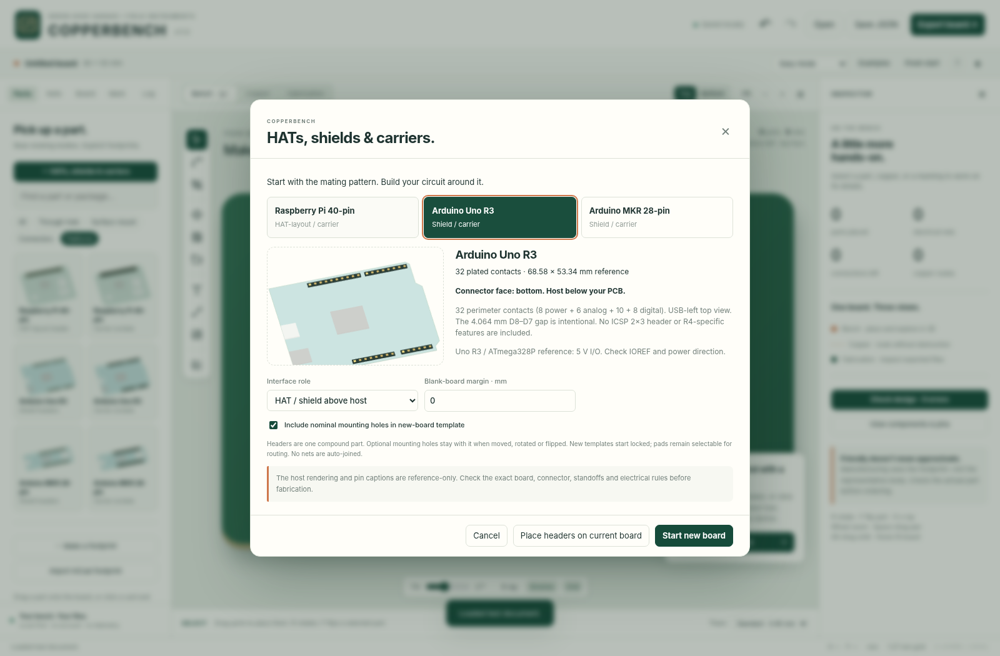

There are **six new Parts → Platforms entries**, one add-on and one carrier
variant per family. Pins are directly routable, with physical contact IDs and
signal aliases in the inspector, hover tooltip and searchable pin table. No pins
are silently joined just because their signal names match. Export a pin-map CSV
from the selected interface's inspector.

| Family | Included geometry | Important boundary |
|---|---|---|
| Raspberry Pi 40-pin | 2×20 connector; physical/BCM aliases; 65×56 mm legacy-style add-on blank; four optional mounts | Not Pico, Compute Module, original 26-pin Pi, or automatic HAT/HAT+ compliance. |
| Arduino Uno R3 | All 32 perimeter contacts; grouped banks; exact 4.064 mm D8–D7 gap; classic-outline starter | ICSP 2×3 is optional. Not a blanket Uno R4 / clone compatibility claim. |
| Arduino MKR 28-pin | Two 14-pin rows; 2.54 mm pitch; 20.32 mm row spacing; shield and carrier roles | WiFi 1010 reference envelope/nominal offsets. Check the actual MKR variant, antenna and power pins. |

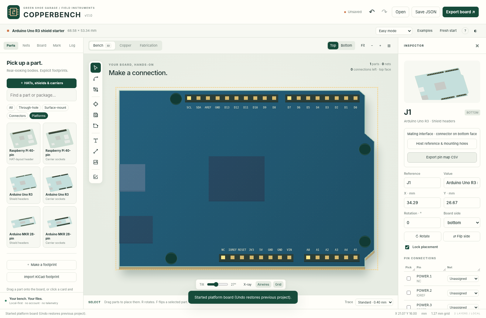

The compound pattern starts **locked** in a new template. Uncheck **Lock placement**
in the inspector to move, rotate or flip it. Its included mounting holes move
with it. **Host reference & mounting holes** toggles the reference illustration,
editor-only captions and real NPTH holes independently. The host picture is not
a collision/clearance model and does not export fake host circuitry.

All dimensions are **nominal, review-required**. Check the purchased connector,
actual host, standoffs, power direction and clearances. See the detailed
[form-factor reference and source register](docs/FORM_FACTORS.md).

**Project format:** v1.6 reads schema-1/2/3/4 projects and writes schema 5. Older apps
reject the new schema instead of silently dropping block records or attached carrier constraints.
Keep the original JSON backup before upgrading. Native JSON preserves platform
aliases, linked mounting holes and plane behavior. KiCad subset exchange retains
supported geometry, not all application metadata.

## Try the complete workflow

1. Open **Examples → Little light**, or open `examples/little-light-routed.json` to inspect the completed routing example. Choose **Fresh start** for an empty board.
2. In **Parts**, click a part and click the board, or drag it from the drawer. **R** rotates; **F** moves the selected component to the opposite face. The inspector has exact position, angle, value and pin assignments.
3. Choose **Connect** (**A**), pick two or more leads belonging on one net, then choose **Preview wire → Keep copper**. Copper is not committed until accepted. Different-net assignments require an explicit merge decision. **Pair connectors** creates separate mapped connections instead of shorting an entire selection together.
4. Choose **Trace** (**T**) for manual routing. Set the visible trace width, click a lead, via or existing trace, add waypoints and click the destination. **V** inserts a through via at the cursor during a route, switches to the opposite layer and continues. The visible **Via → other side** button instead arms the next click. **Enter** finishes an open route; **Esc** cancels unfinished work.
5. Use **Board** to adjust size/shape, draw polygon boundaries, add mounting holes, slots or cutouts. Resizing changes the boundary, never the dimensions of parts or copper.
6. Use **Mark** for text, lines, boxes, ellipses or image conversion. Imported raster/SVG images become explicit silkscreen rectangles, with the source raster retained for reprocessing. Use **Check design**, then **Fabrication**, then **Export board**. Review the actual manufacturer preview before ordering.

For easy whole-board pours, use **Planes**. For manual local pours, draw a **Zone** (**Z**), assign its net and refill. Zones use conservative, vectorized cell fills, with optional thermal reliefs and island removal. Copper/board edits and project imports invalidate pours; stale pours block manufacturing export, even when diagnostic export is selected.

## Established workbench features

| Area | Implemented |
|---|---|
| Physical workbench | Shaded, depth-buffered representative 3D bodies; tilt, orbit, zoom, pan, top/bottom views, x-ray and pin picking. |
| Parts | 193 entries including five module interfaces, 18 controller interfaces and 134 maker variants, named device pins, source notes, optional Uno ICSP, footprint wizard, exact pad editing in Advanced mode, rotate/flip, duplicate, lock, pin table. |
| Circuit blocks | Six routed starters, explicit external ports, isolated-net insertion/copy, editable members, group transforms, project-local library and standalone block JSON. |
| Modules | Five source-identified mating interfaces with named pins, optional mounting holes, reference-only 3D bodies and nominal stack-gap review. |
| Carriers | Nine added host selections, carrier/add-on templates, attached two-face RF guards, access references and editable stack-gap assumptions. |
| Connection intent | Explicit nets independent of drawn copper, visible unrouted connections, guarded net merges, connector-pair mapping. |
| Routing | Width-controlled manual polylines, selected two-/multi-pin A* proposals, keep/reject preview, through vias, cancellable worker jobs. |
| Vias | Visible repeat-placement tool, net inheritance, pad/drill presets and exact sizes, mask tenting, live clearance checks, editable/lockable objects and a management table. |
| Planes | Per-face net assignment, bottom-ground preset, board-following auto-refill, checked lead-to-plane previews, local stub/via helpers, real-region status and split-plane findings. |
| Board/copper | Rectangular, rounded, circular/elliptical and polygon outlines; polygon cutouts/keepouts; holes/slots; thermal and solid cell-derived copper fills. |
| Markings | Drafting text, basic shapes, mirror/rotate, threshold/invert/cleanup image conversion, original-image reprocessing, minimum-feature and clipping warnings. |
| Inspection | Geometry/connectivity findings with severity and evidence, footprint-verification flags, assumptions/evidence register, baseline comparison, HTML/print review report. |
| Files | Native JSON/project ZIP, Gerber X2 or RS-274X compatibility output, Excellon drills/G85 slots, optional paste, BOM CSV, SVG output, bounded KiCad interchange. |
| Workspace | Undo/redo, autosave and recovery snapshots, Easy/Advanced modes, light/dark/high-contrast themes, collapsible drawers/inspector, responsive layout. |

**Bench, Copper and Fabrication are views of one design.** The Fabrication view reads the generated Gerber/Excellon text rather than redrawing the project and calling that verification.

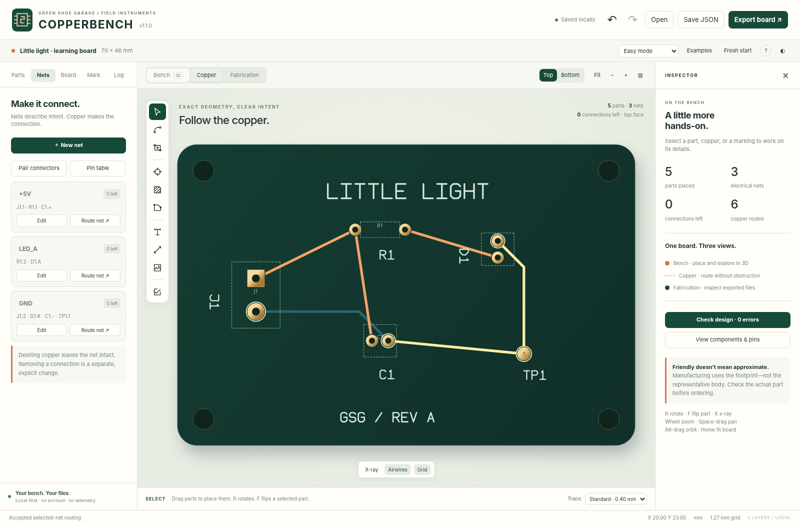

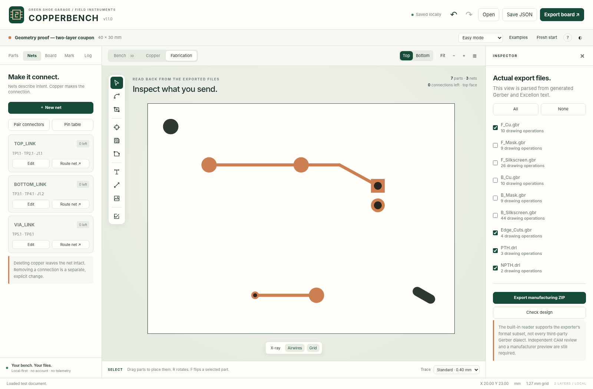

## Manufacturing: inspect before ordering

Export produces front/back copper, mask and silkscreen, an outline/cutout Gerber, and the applicable plated/non-plated drill files. Optional paste layers are available. Coordinates share one physical origin; bottom manufacturing files are not mirrored. The native editor uses millimetres and a top-left, Y-down coordinate system; export converts Y to a lower-left, Y-up system.

An editable OSH Park two-layer rule profile is included with its source and verification date. Manufacturer limits can change. Confirm the selected service, current rules, upload interpretation and preview before placing an order.

**This release has not been submitted to OSH Park, checked by an external CAM product, or physically fabricated.** Its exports passed JavaScript read-back and a separate Python/Shapely geometry regression for a golden test coupon. That is useful evidence, not manufacturer approval or a guarantee that an arbitrary circuit will work.

Generic footprints are marked **unverified** until you check the purchased part's mechanical drawing, pin order and recommended land pattern. Width presets are dimensions, not current ratings. A zero-error layout is not a circuit-function, high-voltage, RF, thermal or regulatory certificate.

## Deliberate boundaries

This is not a complete replacement for an industrial EDA suite. Two copper layers and through vias are supported; multilayer stackups, blind/buried vias, simulation, controlled impedance and push-and-shove routing are not. Automatic routing is selected-connection assistance, not guaranteed full-board optimization. Moving a part leaves existing copper in place and exposes any resulting broken connections.

Copper pours are cell-derived vector rectangles, not a general exact polygon-boolean engine. Arcs imported from KiCad are flattened to polylines. Representative component bodies are not STEP models or mechanical collision certification. The silkscreen alphabet is a bundled geometric drafting alphabet rather than arbitrary typography.

KiCad import/export is an **explicit feature subset**, not general round-trip compatibility. Important unsupported manufacturing features stop import; permitted simplifications are reported. Imported board artwork is flattened; standalone footprint placement imports pads/body, not original footprint artwork. External 3D assets are not fetched. See [format compatibility](docs/COMPATIBILITY.md).

## GitHub-ready repository

Extract the source ZIP and put the **contents of the `copperbench` folder** at
your repository root. Include hidden files and folders. There is no preconfigured
remote, account name, domain, Git history or secret in the package.

The repository includes an illustrated README, MIT and dependency notices,
contribution/security guides, issue and pull-request templates, pinned test
dependencies, a lockfile, source integrity checks, deterministic release
packaging and three GitHub Actions workflows:

| Workflow | Behavior |
|---|---|
| **CI** | Source/asset checks, packaging regressions, engine tests, independent manufacturing geometry and the Chromium interaction harness. |
| **Deploy GitHub Pages** | Manual deployment after Pages setup; optional automatic deployment from `main` with `ENABLE_PAGES=true`. |
| **Draft release** | A matching pushed version tag creates a draft with source/static ZIPs, portable HTML and SHA-256 checksums after CI. |

[GitHub setup](docs/GITHUB.md) explains the initial push and release tags.
[Deployment](docs/DEPLOYMENT.md) covers local launch, Pages and an ordinary static
host. These workflow files are prepared locally; no remote Actions run or live
site is claimed.

```text
copperbench/
├── index.html                 Ready-to-run static entry point
├── COPPERBENCH-portable.html   Self-contained offline edition
├── styles.css                 Responsive themes and layout
├── src/                       PCB model, geometry, renderer, UI and exporters
├── vendor/                    Bundled JSZip and its original license
├── examples/                  Starter designs and regression coupon
├── docs/                      Screenshots, compatibility, guides and evidence
├── tests/                     Engine, browser, manufacturing and packaging tests
├── tools/                     Serve, check, test, rebuild and package commands
├── .github/                   CI, Pages, release and issue/PR templates
├── package.json               Optional npm command shortcuts
├── requirements-dev.txt       Test-only Python dependencies
├── LICENSE                    Original MIT license
└── README.md                  This guide
```

## Developer commands

No dependency installation or compilation is required to use the shipped app.
For development, use Node.js 22+ and Python 3.13. Install test dependencies in a
virtual environment; the full setup is in [testing](docs/TESTING.md).

```sh
python3 tools/serve.py            # Local app at 127.0.0.1:8000
python3 tools/package.py          # Rebuild portable HTML, worker and offline cache
python3 tools/package.py --check  # Verify generated assets without writing
node tests/core.test.js           # Run engine tests; generate test-only coupon
node tests/platforms.test.js      # Platform geometry and export fixtures
node tests/vias.test.js           # Via rules, connectivity, mask and drill fixtures
node tests/planes.test.js         # Plane attachment, real connectivity and export fixtures
python3 tools/test.py             # Run all suites (requires test dependencies)
python3 tools/release.py          # Source ZIP, static ZIP, portable HTML, checksums
```

On Windows, use `py -3` in place of `python3`; the direct Python commands avoid
assuming a particular shell. npm shortcuts are optional and use `python3`.
`npm test` needs Node only; there are no npm dependencies to install.

New results, screenshots and generated fixtures go to ignored `tests/output/`.
They do not rewrite the checked-in examples or documentation images. The browser
runner uses Playwright's installed Chromium by default; `CHROMIUM_EXECUTABLE`
provides an explicit local override. Current test output records actual run times.

After changing runtime source, rebuild and commit the generated files. The
service-worker cache revision is content-derived and scoped to its deployment
path; manual cache-counter edits are unnecessary. Hosted cache lifecycle remains
outside the embedded browser harness's coverage.

See [the roadmap](docs/ROADMAP.md), [architecture](docs/ARCHITECTURE.md),
[release notes](docs/RELEASE_NOTES.md), [changelog](CHANGELOG.md),
[format/profile references](docs/SOURCES.md) and [compatibility](docs/COMPATIBILITY.md).

## License

Original application code is distributed under the MIT license; see `LICENSE`. JSZip 3.10.1 is redistributed under its MIT option with its original license in `vendor/JSZIP-LICENSE.md`. The app uses system UI fonts and its own geometric stroke alphabet; no external font files, component model library, KiCad library bundle, telemetry or remote asset service is included.
