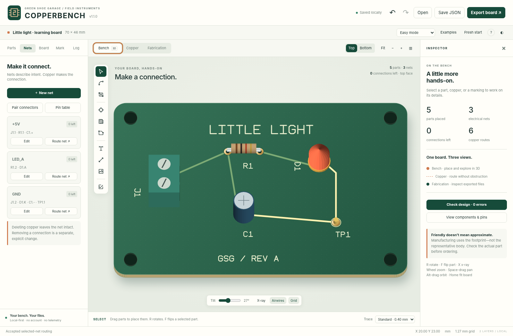
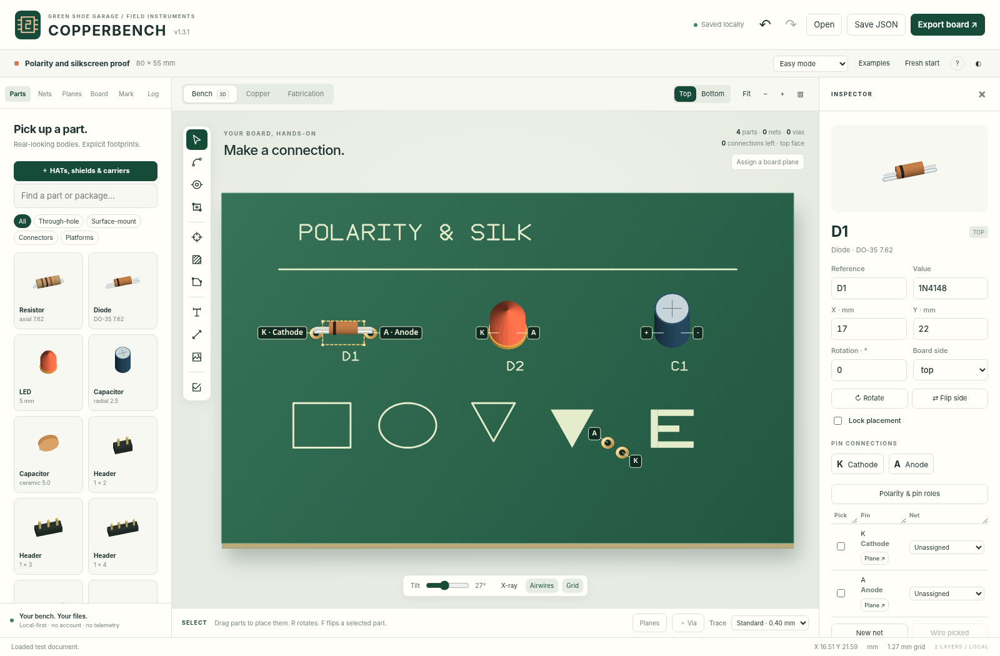

# COPPERBENCH
### A PCB workbench that feels like a PCB.

**Version 1.3.1 · Green Shoe Garage / Field Instruments · 17 September 2026**

[Polarity & silkscreen fix](#polarity-and-silkscreen) · [Power & ground planes](#power-and-ground-planes) · [Create vias](#create-vias) · [HATs & shields](#hats-shields-and-carriers) · [Get started](#start-here) · [Publish to GitHub](docs/GITHUB.md) · [Deploy](docs/DEPLOYMENT.md) · [Verification](docs/TESTING.md) · [Contribute](CONTRIBUTING.md)

Put down a board. Place recognizable parts. Connect their leads. Shape the copper. Add your markings. Inspect the files you will send for fabrication.

COPPERBENCH is a local-first, two-copper-layer PCB layout app with an editable, depth-rendered 3D workbench. **COPPERBENCH is the working title for this release.** The physical bodies are representative; pad geometry and the electrical connection model—not rendered pixels—drive routing, checking and manufacturing export.



## Polarity and silkscreen

**v1.3.1 fixes an export defect that could clear the entire silkscreen. Open your
native project in this version and regenerate its manufacturing ZIP before
ordering. Previously downloaded Gerbers are not repaired by updating the app.**

Diodes and LEDs now identify **A · Anode** and **K · Cathode**. Polarized radial
capacitors identify **+ · Positive** and **− · Negative**. Badges anchor to the
actual pins, remain legible while zooming, and show full role names when selected
or hovered. The inspector and searchable pin table also show the full names.



Select a component and open **Polarity & pin roles** to assign roles to custom or
imported pins, toggle printing, or adjust symbol size, clearance and offsets.
Printed A/K or +/− symbols follow the component's rotation and board face and are
included in the Gerbers. Hiding the reference label does not hide polarity marks;
disabling printed polarity does not remove the editor badges. No operation
silently swaps pin numbers or reassigns nets. Unknown/numeric pin roles are not
guessed from net names or body appearance.

**Fabrication → Top silk only / Bottom silk only** shows the generated files
without component bodies or editor badges. Source text, part references,
polarity marks, drawing tools and converted images survive export, while pad
openings, holes, cutouts and off-board artwork are still cleared.


The old writer incorrectly treated nested Gerber contours like an even-odd hole.
The old viewer and Python test reader repeated that error. All three are fixed;
new tests explicitly reproduce the blank old output and require union semantics.
The clipping replacement uses individual exterior trapezoids, not another nested
frame. See the [fix guide](docs/POLARITY_AND_SILKSCREEN.md) and
[verification record](docs/TESTING.md). **No external CAM acceptance or physical
fabrication is claimed.** Native schema remains 3; save a JSON backup first.

## Start here

**The simplest edition is `COPPERBENCH-portable.html`.** Open that file in a desktop browser. It includes the complete app, component definitions, ZIP support and routing/checking worker source. There is no build step, account, CDN or required internet service.

Alternatively, keep the static app folder together and open `index.html`. A local server is useful where browser file-origin policies interfere with local storage or workers:

```sh
cd copperbench
python3 tools/serve.py
```

Open `http://127.0.0.1:8000/`. Python is optional for using the portable HTML. Node and Python test dependencies are only needed for development/testing.

**Save JSON is your independent backup.** Autosave uses browser-local storage, which can be disabled, full, cleared, or unavailable for local files. A saved-state LED reports persistence status; a failed save does not disable JSON export. Downloaded JSON contains placed footprints and embedded source images.

The release uses a real Chromium DOM/canvas/worker harness with a storage test double and intercepted download blobs. Unrestricted `file://` launch, origin-backed storage, actual download navigation, and hosted service-worker installation were **not** directly verified. Read the [verification record](docs/TESTING.md) for exact coverage instead of treating “offline-capable” as a claim that every browser environment has been tested.

## Power and ground planes

Open **Planes → Bottom ground · top routing**. Or assign a net independently to
**Top copper** and **Bottom copper**. No whole-board polygon drawing is needed.
The plane follows the outline and automatically refills after copper edits.


Choose **Connect a lead to GND** (or your selected net), click a component lead,
then review **Keep connection / Discard**. Through-hole and same-face pads use
existing direct contact when possible. Opposite-face surface-mount pads receive
a short trace and nearby through via, or reuse a suitable existing via. Inspector
pin buttons and picked multi-lead groups expose the same workflow.

**No silent net merges.** Unassigned leads adopt the target net only on acceptance;
a lead on a different net is blocked. Connection status uses real filled-copper
paths, not names. Split planes, stranded leads and stale fills remain visible.
Changing plane assignment does not relabel pins or existing copper. Manual zones
are preserved. New traces carve clearance through managed pours and may split them.

Thermal pad connections, solid via connections, per-face settings, a view-only
hide-fill control, manual refill and one-step undo are included. The local helper
is non-exhaustive and the existing fill engine is conservative/cell-derived.
**Native saves now use schema 3; back up older projects before upgrading.**

[Plane workflow and limitations](docs/PLANES.md) · [Verification](docs/TESTING.md)

## Create vias

Click **＋ Via** beside the trace-width control, choose **Place via** in the Nets
panel, or press **Shift+V**. The inspector shows the via's net, copper-pad diameter,
drill diameter and solder-mask setting. Click the board to place; keep clicking
to place more. **Esc** leaves the tool.


**Auto / from touching copper** takes the net from the copper beneath the via,
including the opposite face. A placement joining different nets is blocked.
For an empty area, choose a named net or create one. Unassigned vias remain
editable but produce a blocking finding before ordinary manufacturing export.
The green/red preview checks the selected rule profile on both copper layers.

| Preset | Copper pad diameter | Drill diameter |
|---|---:|---:|
| Compact | 0.70 mm | 0.30 mm |
| Standard | 0.90 mm | 0.40 mm |
| Large | 1.20 mm | 0.60 mm |

Enter custom dimensions as needed. Presets are geometric conveniences, not
current ratings or universal fabrication approval. The inspector displays the
annular ring and rejects dimensions below the active profile limits.

**During manual tracing**, press **V** at the cursor, or click **Via → other side**
and then the board. The incoming trace and via are one undoable edit, and the
route continues on the opposite layer. A rejected placement leaves the trace
and board unchanged. Traces can start or finish on existing vias and copper.

**To edit**, leave placement mode and select the via—even at a trace endpoint.
Change its position, net, diameters, mask coverage or lock state. **Manage vias**
in the Nets panel lists all vias. Moving a connected via does not stretch the
attached traces; resulting disconnections are reported.

A via is real copper on **both faces** and **one plated Excellon drill**, not an
NPTH mounting hole. **Tent both sides** omits its solder-mask openings on both
faces; it does not request hole filling or guarantee a physically sealed hole.
Native JSON preserves all settings. The bounded KiCad exchange preserves via
geometry/nets, but not per-via tenting or locks; the app warns before that export.

See the [via guide](docs/VIAS.md), [format limits](docs/COMPATIBILITY.md), and
[verification record](docs/TESTING.md). No manufacturer upload or physical test
board is claimed for this release.

## HATs, shields and carriers

**Parts → HATs, shields & carriers** opens the new form-factor workflow. Select
Raspberry Pi 40-pin, Arduino Uno R3, or Arduino MKR 28-pin; choose an add-on above
the host or a carrier below it. **Start new board** creates an outlined blank
with the mating pattern and optional mounting holes. **Place headers on current
board** adds only the interface, preserving your existing layout.


There are **six new Parts → Platforms entries**, one add-on and one carrier
variant per family. Pins are directly routable, with physical contact IDs and
signal aliases in the inspector, hover tooltip and searchable pin table. No pins
are silently joined just because their signal names match. Export a pin-map CSV
from the selected interface's inspector.

| Family | Included geometry | Important boundary |
|---|---|---|
| Raspberry Pi 40-pin | 2×20 connector; physical/BCM aliases; 65×56 mm legacy-style add-on blank; four optional mounts | Not Pico, Compute Module, original 26-pin Pi, or automatic HAT/HAT+ compliance. |
| Arduino Uno R3 | All 32 perimeter contacts; grouped banks; exact 4.064 mm D8–D7 gap; classic-outline starter | ICSP 2×3 not included. Not a blanket Uno R4 / clone compatibility claim. |
| Arduino MKR 28-pin | Two 14-pin rows; 2.54 mm pitch; 20.32 mm row spacing; shield and carrier roles | WiFi 1010 reference envelope/nominal offsets. Check the actual MKR variant, antenna and power pins. |


The compound pattern starts **locked** in a new template. Uncheck **Lock placement**
in the inspector to move, rotate or flip it. Its included mounting holes move
with it. **Host reference & mounting holes** toggles the reference illustration,
editor-only captions and real NPTH holes independently. The host picture is not
a collision/clearance model and does not export fake host circuitry.

All dimensions are **nominal, review-required**. Check the purchased connector,
actual host, standoffs, power direction and clearances. See the detailed
[form-factor reference and source register](docs/FORM_FACTORS.md).

**Project format:** v1.3 reads schema-1/2 projects and writes schema 3. Older apps
reject the new schema instead of silently dropping automatic plane semantics.
Keep the original JSON backup before upgrading. Native JSON preserves platform
aliases, linked mounting holes and plane behavior. KiCad subset exchange retains
supported geometry, not all application metadata.

## Try the complete workflow

1. Open **Examples → Little light**, or open `examples/little-light-routed.json` to inspect the completed routing example. Choose **Fresh start** for an empty board.
2. In **Parts**, click a part and click the board, or drag it from the drawer. **R** rotates; **F** moves the selected component to the opposite face. The inspector has exact position, angle, value and pin assignments.
3. Choose **Connect** (**A**), pick two or more leads belonging on one net, then choose **Preview wire → Keep copper**. Copper is not committed until accepted. Different-net assignments require an explicit merge decision. **Pair connectors** creates separate mapped connections instead of shorting an entire selection together.
4. Choose **Trace** (**T**) for manual routing. Set the visible trace width, click a lead, via or existing trace, add waypoints and click the destination. **V** inserts a through via at the cursor during a route, switches to the opposite layer and continues. The visible **Via → other side** button instead arms the next click. **Enter** finishes an open route; **Esc** cancels unfinished work.
5. Use **Board** to adjust size/shape, draw polygon boundaries, add mounting holes, slots or cutouts. Resizing changes the boundary, never the dimensions of parts or copper.
6. Use **Mark** for text, lines, boxes, ellipses or image conversion. Imported raster/SVG images become explicit silkscreen rectangles, with the source raster retained for reprocessing. Use **Check design**, then **Fabrication**, then **Export board**. Review the actual manufacturer preview before ordering.

For easy whole-board pours, use **Planes**. For manual local pours, draw a **Zone** (**Z**), assign its net and refill. Zones use conservative, vectorized cell fills, with optional thermal reliefs and island removal. Copper/board edits and project imports invalidate pours; stale pours block manufacturing export, even when diagnostic export is selected.

## What is in v1.3.1

| Area | Implemented |
|---|---|
| Physical workbench | Shaded, depth-buffered representative 3D bodies; tilt, orbit, zoom, pan, top/bottom views, x-ray and pin picking. |
| Parts | More than 30 generic packages, through-hole and SMD, footprint wizard, exact pad editing in Advanced mode, rotate/flip, duplicate, lock, pin table. |
| Connection intent | Explicit nets independent of drawn copper, visible unrouted connections, guarded net merges, connector-pair mapping. |
| Routing | Width-controlled manual polylines, selected two-/multi-pin A* proposals, keep/reject preview, through vias, cancellable worker jobs. |
| Vias | Visible repeat-placement tool, net inheritance, pad/drill presets and exact sizes, mask tenting, live clearance checks, editable/lockable objects and a management table. |
| Planes | Per-face net assignment, bottom-ground preset, board-following auto-refill, checked lead-to-plane previews, local stub/via helpers, real-region status and split-plane findings. |
| Board/copper | Rectangular, rounded, circular/elliptical and polygon outlines; polygon cutouts/keepouts; holes/slots; thermal and solid cell-derived copper fills. |
| Markings | Drafting text, basic shapes, mirror/rotate, threshold/invert/cleanup image conversion, original-image reprocessing, minimum-feature and clipping warnings. |
| Inspection | Geometry/connectivity findings with severity and evidence, footprint-verification flags, assumptions/evidence register, baseline comparison, HTML/print review report. |
| Files | Native JSON/project ZIP, Gerber X2 or RS-274X compatibility output, Excellon drills/G85 slots, optional paste, BOM CSV, SVG output, bounded KiCad interchange. |
| Workspace | Undo/redo, autosave and recovery snapshots, Easy/Advanced modes, light/dark/high-contrast themes, collapsible drawers/inspector, responsive layout. |

**Bench, Copper and Fabrication are views of one design.** The Fabrication view reads the generated Gerber/Excellon text rather than redrawing the project and calling that verification.


## Manufacturing: inspect before ordering

Export produces front/back copper, mask and silkscreen, an outline/cutout Gerber, and the applicable plated/non-plated drill files. Optional paste layers are available. Coordinates share one physical origin; bottom manufacturing files are not mirrored. The native editor uses millimetres and a top-left, Y-down coordinate system; export converts Y to a lower-left, Y-up system.

An editable OSH Park two-layer rule profile is included with its source and verification date. Manufacturer limits can change. Confirm the selected service, current rules, upload interpretation and preview before placing an order.

**This release has not been submitted to OSH Park, checked by an external CAM product, or physically fabricated.** Its exports passed JavaScript read-back and a separate Python/Shapely geometry regression for a golden test coupon. That is useful evidence, not manufacturer approval or a guarantee that an arbitrary circuit will work.

Generic footprints are marked **unverified** until you check the purchased part's mechanical drawing, pin order and recommended land pattern. Width presets are dimensions, not current ratings. A zero-error layout is not a circuit-function, high-voltage, RF, thermal or regulatory certificate.

## Deliberate boundaries

This is not a complete replacement for an industrial EDA suite. Two copper layers and through vias are supported; multilayer stackups, blind/buried vias, simulation, controlled impedance and push-and-shove routing are not. Automatic routing is selected-connection assistance, not guaranteed full-board optimization. Moving a part leaves existing copper in place and exposes any resulting broken connections.

Copper pours are cell-derived vector rectangles, not a general exact polygon-boolean engine. Arcs imported from KiCad are flattened to polylines. Representative component bodies are not STEP models or mechanical collision certification. The silkscreen alphabet is a bundled geometric drafting alphabet rather than arbitrary typography.

KiCad import/export is an **explicit feature subset**, not general round-trip compatibility. Important unsupported manufacturing features stop import; permitted simplifications are reported. Imported board artwork is flattened; standalone footprint placement imports pads/body, not original footprint artwork. External 3D assets are not fetched. See [format compatibility](docs/COMPATIBILITY.md).

## GitHub-ready repository

Extract the source ZIP and put the **contents of the `copperbench` folder** at
your repository root. Include hidden files and folders. There is no preconfigured
remote, account name, domain, Git history or secret in the package.

The repository includes an illustrated README, MIT and dependency notices,
contribution/security guides, issue and pull-request templates, pinned test
dependencies, a lockfile, source integrity checks, deterministic release
packaging and three GitHub Actions workflows:

| Workflow | Behavior |
|---|---|
| **CI** | Source/asset checks, packaging regressions, engine tests, independent manufacturing geometry and the Chromium interaction harness. |
| **Deploy GitHub Pages** | Manual deployment after Pages setup; optional automatic deployment from `main` with `ENABLE_PAGES=true`. |
| **Draft release** | A matching pushed version tag creates a draft with source/static ZIPs, portable HTML and SHA-256 checksums after CI. |

[GitHub setup](docs/GITHUB.md) explains the initial push and release tags.
[Deployment](docs/DEPLOYMENT.md) covers local launch, Pages and an ordinary static
host. These workflow files are prepared locally; no remote Actions run or live
site is claimed.

```text
copperbench/
├── index.html                 Ready-to-run static entry point
├── COPPERBENCH-portable.html   Self-contained offline edition
├── styles.css                 Responsive themes and layout
├── src/                       PCB model, geometry, renderer, UI and exporters
├── vendor/                    Bundled JSZip and its original license
├── examples/                  Starter designs and regression coupon
├── docs/                      Screenshots, compatibility, guides and evidence
├── tests/                     Engine, browser, manufacturing and packaging tests
├── tools/                     Serve, check, test, rebuild and package commands
├── .github/                   CI, Pages, release and issue/PR templates
├── package.json               Optional npm command shortcuts
├── requirements-dev.txt       Test-only Python dependencies
├── LICENSE                    Original MIT license
└── README.md                  This guide
```

## Developer commands

No dependency installation or compilation is required to use the shipped app.
For development, use Node.js 22+ and Python 3.13. Install test dependencies in a
virtual environment; the full setup is in [testing](docs/TESTING.md).

```sh
python3 tools/serve.py            # Local app at 127.0.0.1:8000
python3 tools/package.py          # Rebuild portable HTML, worker and offline cache
python3 tools/package.py --check  # Verify generated assets without writing
node tests/core.test.js           # Run engine tests; generate test-only coupon
node tests/platforms.test.js      # Platform geometry and export fixtures
node tests/vias.test.js           # Via rules, connectivity, mask and drill fixtures
node tests/planes.test.js         # Plane attachment, real connectivity and export fixtures
python3 tools/test.py             # Run all suites (requires test dependencies)
python3 tools/release.py          # Source ZIP, static ZIP, portable HTML, checksums
```

On Windows, use `py -3` in place of `python3`; the direct Python commands avoid
assuming a particular shell. npm shortcuts are optional and use `python3`.
`npm test` needs Node only; there are no npm dependencies to install.

New results, screenshots and generated fixtures go to ignored `tests/output/`.
They do not rewrite the checked-in examples or documentation images. The browser
runner uses Playwright's installed Chromium by default; `CHROMIUM_EXECUTABLE`
provides an explicit local override. Current test output records actual run times.

After changing runtime source, rebuild and commit the generated files. The
service-worker cache revision is content-derived and scoped to its deployment
path; manual cache-counter edits are unnecessary. Hosted cache lifecycle remains
outside the embedded browser harness's coverage.

See [the roadmap](docs/ROADMAP.md), [architecture](docs/ARCHITECTURE.md),
[release notes](docs/RELEASE_NOTES.md), [changelog](CHANGELOG.md),
[format/profile references](docs/SOURCES.md) and [compatibility](docs/COMPATIBILITY.md).

## License

Original application code is distributed under the MIT license; see `LICENSE`. JSZip 3.10.1 is redistributed under its MIT option with its original license in `vendor/JSZIP-LICENSE.md`. The app uses system UI fonts and its own geometric stroke alphabet; no external font files, component model library, KiCad library bundle, telemetry or remote asset service is included.
