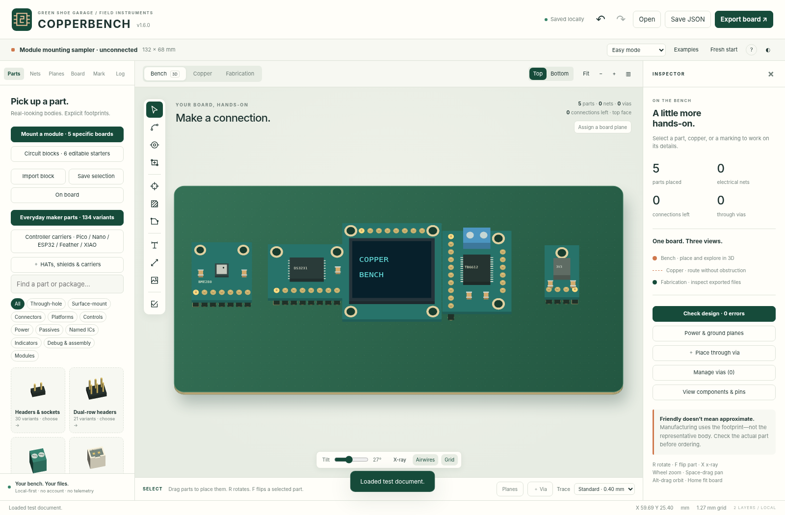

# Modules and circuit blocks — COPPERBENCH v1.6

**v1.6.1 navigation:** catalog buttons are shortened; see the [current interface guide](QUIET_WORKBENCH.md). All workflows described here remain.

v1.6 separates **mounting a purchased module** from **building an editable circuit**.
The application has 193 component entries, including five new specific module
interfaces, plus a separate catalog of six circuit blocks. Earlier parts, controller
carriers, vias, planes, polarity labels and manufacturing exporters are retained.

## Mount a module

Open **Parts → Mount a module**. Select an exact board identity, optionally enable
mounting holes, and enter an assumed underside gap. Choose **Start carrier board**
or **Place on current board**. The first creates a locked mating footprint and a
nominal board boundary with 7 mm margin on each side. The second leaves the existing
board unchanged and lets you click the placement position.

The footprint represents your carrier's mating header contacts. It is **not** the
host module's internal circuit, and host-mounted connectors are not automatically
additional contacts on your PCB. New contacts have no nets assigned. Use the normal
pin inspector, manual/automatic routing and plane connection helper.

Select the interface and open **Module fit, source & pin map** to change optional
mounting holes, the assumed stack gap, the body visibility and the explicit review
flag. Pin-map CSV includes named contacts. Source CAD URLs and blob hashes are
embedded in project JSON; no runtime network fetch is needed.

| Entry | Identity and scope | Contacts | Important distinction |
|---|---|---:|---|
| BME280 | Adafruit 2652, original non-QT board | 7 | VIN and regulator output 3Vo are different contacts. Not the later QT revision. |
| DS3231 | Adafruit 3013, original eight-pin revision A | 8 | Includes VBAT, 32 kHz, SQW and RESET. The reverse-side battery holder needs clearance. |
| 0.96-inch OLED | Adafruit 326, named 128×64 STEMMA QT PCB | 8 | Display-face-up mounting reflects source X. On-module QT sockets are not additional carrier pads. |
| TB6612 | Adafruit 2448, named motor-driver breakout | 16 | Separate motor/logic power, ten control/power contacts and six motor-output contacts. |
| MPM3610 | Adafruit 4683, 3.3 V assembled module | 4 | EN / VIN / output / GND. Not the 5 V feedback-resistor variant. |

These identities and source pin/center data are adapted from the supplier CAD files
listed below. **Body envelopes, socket drills and stack-height assumptions are
nominal choices, not verified assembly tolerances.** Default mating pads are 1.8 mm
and round drills are 1.0 mm. Check the actual connector specification. Optional
mounting-hole centers follow the selected part, including rotation and side flips;
the nominal clear-hole diameters must also be reviewed for the actual fastener.

### Appearance versus fabrication

The representative host boards are rendered as raised 3D bodies. OLED, sensor, RTC,
motor-driver and converter entries have different appearances. Actual carrier pads
remain at the board plane. Use **Copper**, X-ray, or hide the body to route beneath it.

Host artwork, display text, pin captions and source notes are editor references.
They do **not** become copper, silkscreen or drills. Fabrication includes carrier pads,
enabled mounting holes and any reference/polarity silkscreen explicitly enabled by
the user. The Fabrication view reads generated Gerber and drill text.

A body-overlap/stack-gap warning is an approximate projected-envelope check, not a
mechanical solver. It does not establish socket compatibility, cable bend radius,
underside battery clearance, tolerance fit, thermal performance or electrical safety.

## Build a circuit block

Open **Parts → Circuit blocks**. Choose a starter, review its notes, optionally edit
component values, and choose whether to include its saved copper. Use **Insert at
coordinates** or **Pick board location**. While picking, **R** rotates, **F** flips
components and copper together, and **Esc** cancels. Placement rejects newly
introduced copper conflicts and out-of-board copper without a partial edit.

| Starter | Included topology | Review before use |
|---|---|---|
| LED indicator | Interface, 1 kΩ series resistor, generic 5 mm LED | LED forward voltage, polarity, GPIO drive and resistor dissipation. |
| Button + pull-up | Three-pin interface, 10 kΩ resistor, four-lead switch | Actual internally common contact pairs, logic voltage and debounce. |
| I²C pull-ups | Four-pin interface, two 4.7 kΩ pull-ups, 100 nF capacitor | Existing pull-ups, bus voltage/capacitance and rise-time requirements. |
| Supply decoupling | Two-pin interface, 100 nF plus 10 µF capacitors | Voltage ratings, bulk-capacitor polarity, placement and transient needs. |
| DC input starter | Input/output headers, resettable-fuse template, series Schottky, bulk capacitor | This is an unqualified topology, not a certified protection circuit. Select real ratings and account for diode drop, temperature and loads. |
| RC signal filter | Three-pin interface, 1 kΩ resistor, 100 nF capacitor | Source/load impedance, input protection and signal bandwidth. |

Values are editable starting points. A topology with zero unrouted connections does
not prove circuit function. No simulation, mains-voltage suitability, USB-C role
controller, battery charger or certified protection behavior is supplied. The DC
input starter is not a regulator and does not guarantee any safe operating rating.

### Connections are explicit, copies are isolated

Every insertion receives new component IDs, normal fresh reference designators, and
fresh net IDs. Net names are scoped, for example `B1/DRIVE` and `B2/DRIVE`. Even a net
called **GND** is isolated by default. Matching names do not silently join circuits.

The external-port dropdowns can deliberately map a block port to an existing project
net. Internal nets remain fresh. Mapping two distinct ports to one project net during
insertion is rejected to prevent accidental shorts. Existing normal explicit
whole-net merge actions are still available afterward and update group port records.
A mapping establishes connection intent; it does not add a route to remote copper.

Insertion is one undo step. Individual parts, traces and vias remain ordinary editable
objects. There is no live link back to the library: updates to a template never rewrite
an already placed circuit or an existing embedded footprint.

### Work on a whole block

Select a member and open **Circuit block · select / copy / export**. **Select whole
block** selects its components, traces and vias. Drag a selected member, use R/F,
nudge with arrow keys, or enter a precise anchor/rotation in the dialog. Internal
copper follows the group. Locked members block a group transform.

Clicking a single member after clearing the group selection edits that object only.
External board traces do not stretch when a group or a component moves; recheck
connectivity afterward. Group transforms use the ordinary DRC-after-edit workflow;
only new block insertion uses the additional preflight gate.

**Copy with fresh nets** captures the group's current, possibly edited geometry and
arms a new placement. **Detach grouping** removes the grouping metadata without
altering parts, nets, copper or generated manufacturing files. Deleting members prunes
the group; deleting all members removes its empty record.

## Reuse your own circuits

Select the components and any traces/vias you want to preserve, then choose **Save
selection**. A selected whole block includes its tracked internal copper. New external
routes are ordinary independent objects; explicitly include them in a captured
selection when needed. Capturing components without copper preserves net intent but
produces an unrouted insertion.

The personal library belongs to the current project and is included in native JSON
and project ZIP backups. **Import block** reviews a `.copperblock.json` file before
adding a fresh library copy; it does not replace the current board. Use **Export
template** in the picker or **Export block JSON** in the group dialog to share it.

Block exchange has its own `COPPERBENCH-BLOCK` schema 1. It supports components,
traces, vias, nets and named ports. Attached mounting-hole and carrier-keepout metadata
is preserved as part of the component. Standalone artwork, loose holes, board shapes,
zones, separate keepouts and image assets are not supported; attempts to capture or
import them are rejected rather than silently dropped. Limits: 100 components,
500 traces, 500 vias, 200 nets and 100 ports per template; 100 personal templates per
project. The file-input limit is 2 MB.

## Examples, persistence and interchange

**Examples → Module sampler** and **Examples → Circuit-block sampler** open the
included layouts; Undo restores the previous document. The module sampler is
unconnected. Circuit blocks have routed internal topology but are not a complete
application circuit. `examples/modules/` contains the five editable carriers;
`examples/blocks/` contains six independent shareable templates and a board sampler.

**Back up before upgrading.** v1.6 reads native schemas 1–4 and writes schema 5.
The newer schema retains module and block records and the personal library. Older
COPPERBENCH versions reject it rather than silently lose newer behavior. Existing
embedded footprints are not replaced by catalog definitions on import.

KiCad interchange exports supported ordinary footprints, copper and net assignments.
Module identity/fit notes, group membership, template library and advisory rendering
are not preserved; the export dialog warns about this. Attached carrier antenna
keepouts retain v1.5's documented conversion to independent KiCad keepouts. Keep
native JSON as the lossless master. Direct Gerber/Excellon export remains two-layer.

## Source reference ledger

Source data were manually read from the published Eagle files and reviewed on
**2026-09-18**. Values were transcribed into original mating-interface definitions.
The tests check those definitions and exported coordinates against literal reference
values; they do not re-download or re-parse whole supplier designs at runtime.
The URL is a branch path; the recorded Git blob hash identifies the reviewed content,
not a guarantee that the URL will remain unchanged.

| Interface | Published CAD source | Reviewed blob hash |
|---|---|---|
| BME280 | [Adafruit BME280.brd](https://github.com/adafruit/Adafruit-BME280-Breakout-PCB/blob/master/Adafruit%20BME280.brd) | `e8be40064f9f7a22b5dc45d40247c0025515ec48` |
| DS3231 | [Adafruit DS3231 RTC Breakout.brd](https://github.com/adafruit/Adafruit-DS3231-Precision-RTC-Breakout-PCB/blob/master/Adafruit%20DS3231%20RTC%20Breakout.brd) | `7f3413130a6e2a703acb3a75ffbb69ada47d840a` |
| OLED | [Adafruit 0.96in 128x64 OLED STEMMA QT.brd](https://github.com/adafruit/Adafruit-128x64-Monochrome-OLED-PCB/blob/master/Adafruit%200.96in%20128x64%20OLED%20STEMMA%20QT.brd) | `3e15e053ae726248d45ce16f08d1e68f96068661` |
| TB6612 | [Adafruit TB6612.brd](https://github.com/adafruit/Adafruit-TB6612-Motor-Driver-Breakout-PCB/blob/master/Adafruit%20TB6612.brd) | `17df1afba1d4e98543dde18b57d9bcaed180659d` |
| MPM3610 | [Adafruit MPM3610.brd](https://github.com/adafruit/Adafruit-MPM3610-PCB/blob/master/Adafruit%20MPM3610.brd) | `3127bb5a8e53b0ef52141bac69a74f3eaf23193d` |

Original data attribution: **Adafruit Industries; Limor Fried / Ladyada and
contributors**. The adapted module interface data are CC BY-SA 3.0. Application
logic, original representative renderings and circuit-block examples remain MIT.
See [MODULE-NOTICES.txt](../MODULE-NOTICES.txt) for retained supplier text, license
links, and a record of the coordinate changes. No supplier images or logos are
bundled; no endorsement is implied.

## What has not been verified

No physical module fit, actual assembled-circuit operation, electrical simulation,
external CAM acceptance, manufacturer-upload acceptance or fabricated-board inspection
is claimed. Browser regression tests use real Chromium UI/canvas/workers with
simulated storage and intercepted download blobs. Native browser download navigation,
file-origin persistence, hosted service-worker behavior, Safari and Firefox require
separate verification. The existing cell-derived pour engine and documented KiCad
subset retain their earlier limits.
