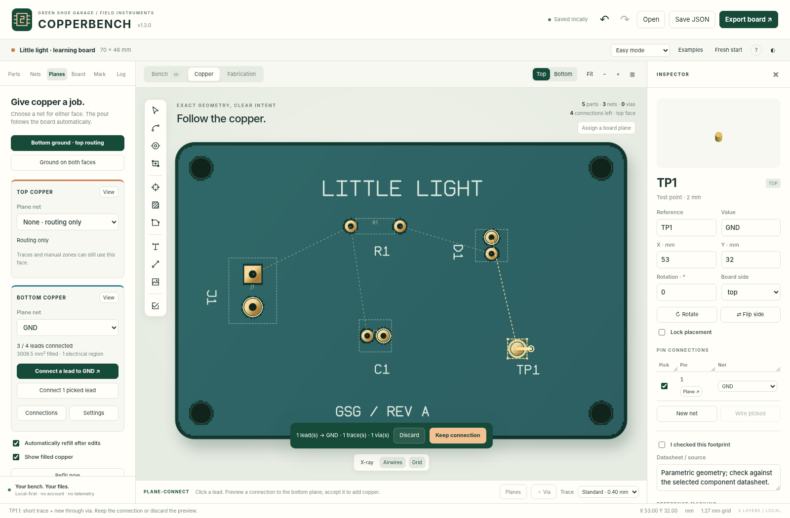
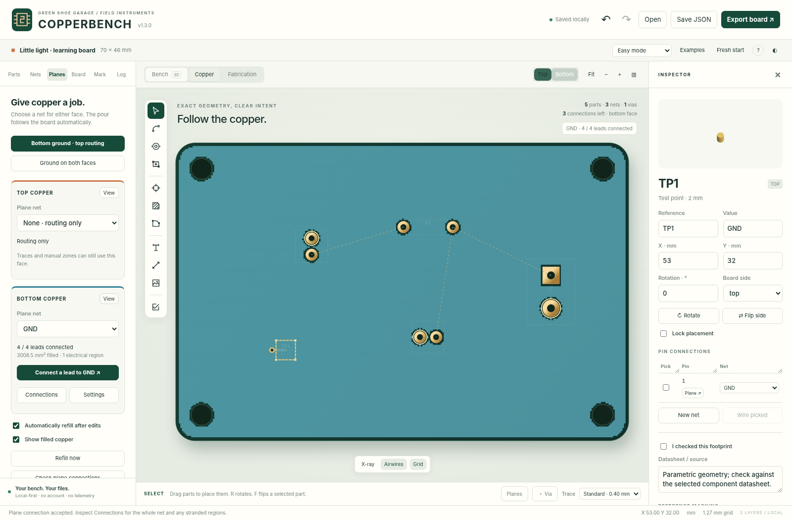

# Easy power and ground planes — COPPERBENCH v1.3

Assign a job to each copper face, then connect component leads to it. No hand-drawn whole-board polygon is required. A managed plane is an automatically maintained **copper pour**, not a promise of an uninterrupted electrical reference or a powered circuit.

## Set up the board

Open **Planes**, then choose **Bottom ground · top routing**. The bottom receives a GND pour while the top stays available for routing. The preset reuses a net named GND or Ground; otherwise it creates GND. It does not assign any component pins. **Ground on both faces** is a second explicit preset.

Each face has a **Plane net** dropdown. Select an existing net, choose **New net** (for example +3V3 or +5V), or choose **None · routing only**. A net's name does not set or verify voltage. A power plane is never inferred merely from a component name or pin alias.

The plane follows rectangular, rounded, circular and polygon board outlines. Resizing changes its boundary and refill, never component pitch or copper width. Internal cutouts, holes, keepouts and other-net copper retain their required clearances. Manual local zones are kept and filled first; managed whole-board zones are filled afterward.

## Attach a lead

Choose **Connect a lead to GND** (or the chosen power net) in that face's card and click a visible component lead. Review the proposed connection, then choose **Keep connection** or **Discard**.

The inspector's per-pin **Plane ↗** button, pad context menu, and **Connect to plane** button for picked leads expose the same workflow. Pick several leads in Connect mode to attach them as one transaction. Different-net pins are blocked, not silently merged. Unassigned pins adopt the target net only on acceptance.

| Lead and actual copper | Proposed result |
|---|---|
| Through-hole pad already reaching the selected pour | Existing plated connection; no needless via. |
| Surface-mount pad on the same face | Direct pad-to-pour contact when fill reaches it; otherwise a short route is attempted. |
| Surface-mount pad on the opposite face | Short trace to a nearby plane-connected via, or a new through via plus short trace. |
| Same net but stranded behind a gap/keepout | Local route search, followed by actual-copper verification. Failure leaves the board unchanged. |
| Pin assigned to a different net | Actionable rejection; explicit circuit-intent editing is required. |

A new via is not drilled in the solder pad. Its copper, drill, clearances and incoming trace use current project defaults and fabrication limits. The helper checks the selected lead itself against hard copper, holes and keepouts. Existing vias are reused when a suitable local route is found.

The worker operates on a clone. No proposed pin assignment, copper or drill is committed until acceptance. An accepted batch is one undo step. Cancellation, a conflicting pin, an impossible local path, or a stale result after another edit never partially commits the proposal.

## Read connectivity, not only colors

The card reports actual connected leads and electrical regions after fill. **Connections** explains which same-net leads reach the selected face's largest electrically connected filled region. Separate seeded regions produce a blocking split-plane finding; other same-net pads outside the main region are identified. Whole-net unrouted findings remain available too.

A plane with no attached same-net seed copper is reported as **No attached copper yet**: it is not displayed as a fictitious electrical connection. Unseeded islands are removed by the fill engine. Two GND faces do not join simply because they share a name; a through-hole pad or via must make that physical connection.

“Connected” does not verify a power source, voltage, current, acceptable return-current path, thermal behavior or a functioning circuit. A signal trace can split a pour. Review the resulting geometry and findings; a mostly filled face is not necessarily an unbroken reference plane.

## Automatic refill and editing

**Automatically refill after edits** is on for new projects. Copper-affecting changes invalidate the old fills, and a revision-checked worker recomputes them after editing pauses. Derived automatic fills do not create extra undo steps. The worker waits while a route or connection preview is active and discards obsolete results.

Turn automatic refill off to control timing manually. **Refill now** rebuilds all zones. Manufacturing generation refuses stale fills, including diagnostic export. Turning **Show filled copper** off hides the display only; it does not remove manufacturing geometry.

Changing a face to a different plane net requires confirmation and never reassigns the old pin, trace or via nets. Removing a managed plane preserves all manually placed copper, component assignments and other zones.

## Thermal settings

**Settings** for each face controls thermal style, gap, spoke width and fill-cell size. Managed-plane component pads use thermal spokes by default; through vias use solid attachments. Disable thermal spokes for solid pad connections. Smaller cells may retain narrower passages but require more processing.

These are geometric settings, not current ratings or a thermal solver. This version does not enforce an industrial minimum-spoke-count rule for every possible geometry. Inspect small pad connections and exported copper closely.

## Files and limitations

Native JSON **schema 3** and project ZIP preserve the managed-plane marker, face, net, settings and filled geometry. Old schema-1/2 projects import without changing the source files. Existing planes are not invented during migration. On project import, derived fills are recomputed. v1.0–v1.2 cannot read schema-3 files; keep a pre-upgrade backup.

Gerber exports the actual filled regions; Excellon includes real through-via drills. Mask openings follow pad/via settings, not the area of the whole plane. KiCad subset export retains ordinary copper zones, not COPPERBENCH's automatic board-following behavior or full workspace metadata. Reimport requires refill and does not reconstruct managed-plane semantics. Use native JSON as the lossless master.

The inherited fill engine emits conservative cell-derived vector rectangles. It is not an exact general-purpose polygon solver; boundaries can be stair-stepped and fine passages can disappear. The attachment helper is local and non-exhaustive (nearby routes within 14 mm; up to eight filled new-via candidate attempts), not a guarantee that every possible route will be found. Complex or congested boards may require manual routing and via placement.

The app remains two-copper-layer only. No external CAM certification, manufacturer acceptance, installed-KiCad validation, physical fabrication, current-capacity test, controlled-impedance analysis or electrical-function test is claimed. See [TESTING.md](TESTING.md) and [COMPATIBILITY.md](COMPATIBILITY.md).
