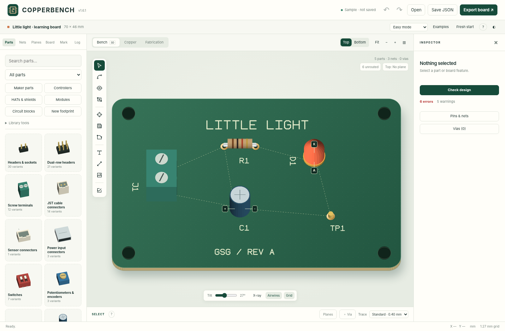
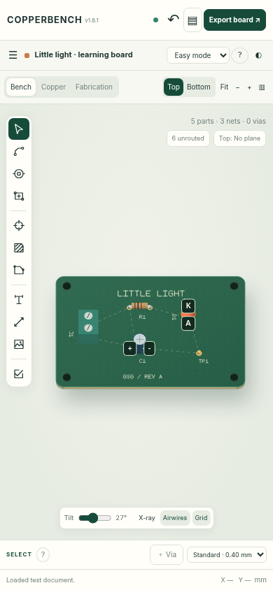

# Quieter workbench — v1.6.1

## Main screen

The welcome overlay, canvas slogans, drawer footer slogans and repeated
introductory paragraphs have been removed. The empty inspector contains only
selection guidance, design-check status and quick access to pins/nets and vias.
Board part/net/via counts are shown once. The current face's plane assignment
and unrouted count remain available on the board.

## Parts drawer

Search and the **Part category** dropdown filter the same library. **Maker parts**,
**Controllers**, **HATs & shields**, **Modules**, **Circuit blocks**, and **New
footprint** open the existing full workflows. There are still 193 parts and six
built-in circuit-block templates.

Expand **Library tools** for **Import block**, **Save selection**, **Blocks on
board**, or **Import KiCad footprint**. Its disclosure can be opened with Enter
or Space and stays open through redraws of the current panel. Catalog detail,
source, pin-map, fit and caution information remains in its original dialogs.

Older feature guides and screenshots may show the previous longer catalog-button
labels; the functionality has not been removed. The new labels above are current.

## Help without overlays

The Select tool has no idle instruction sentence. An active tool shows one short
next-step hint. Select the **?** beside the active tool name for full guidance;
opening and closing help does not cancel your operation or edit the project.
Header **?** and **H** open the full guide and keyboard reference. Detailed notes
on net intent, disconnected pours, manufacturing geometry, clipping and limits
remain in that guide rather than being repeated across the workbench.

## Safety and files

This is not a switch that hides warnings. Autosave failure messages, live design
error/warning counts, unrouted indicators, pin/polarity labels, blocked placement
messages, source qualifications, confirmation dialogs and export gates remain.
Fabrication still reads generated Gerber/drill text, with independently inspected
manufacturing files still required before ordering.

Native schema stays at **5**. Existing v1.6 JSON projects and embedded footprints
need no migration. Back up your project before replacing the full app folder or
portable file. All library, router, plane, via and manufacturing code is retained;
core.js changes only its app version, alongside app/UI and generated assets.

## Verification limits

The release has engine, separate Python/Shapely geometry, packaging and Chromium
regression coverage; see [Testing](TESTING.md). Browser checks execute real DOM,
canvas and workers with simulated local storage and intercepted export blobs.
A localhost navigation attempt was blocked by the managed Chromium environment
with ERR_BLOCKED_BY_ADMINISTRATOR before app startup. Real-origin storage,
downloads, hosted offline lifecycle, external CAM, fabrication acceptance and
physical-board validation are not claimed. No remote repository was changed.

## Navigation update (v1.6.3)

A labelled **Pan** button now sits beside Fit. Detailed instructions remain in
on-demand tool help; no idle canvas banner was restored. See [navigation](NAVIGATION.md).
